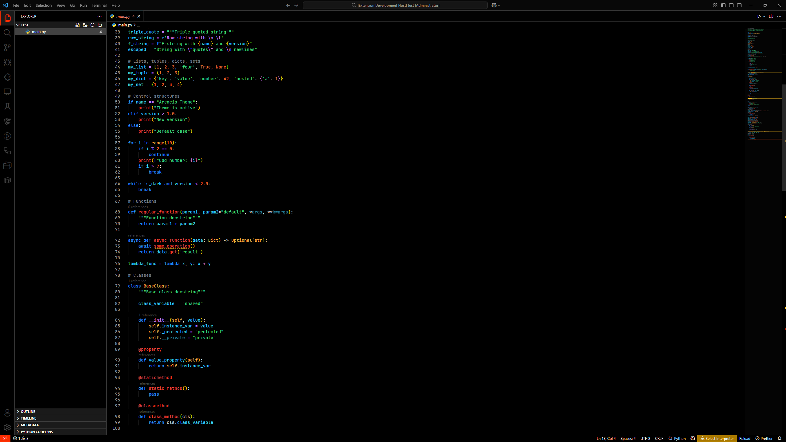

# Arencio Vibrant Dark

A vibrant dark theme for Visual Studio Code inspired by the passionate colors of Italian automotive design. Experience coding with the elegance and intensity of classic Italian sports cars.

## Features

- **Rich, vibrant colors** inspired by iconic Italian automotive paint schemes
- **Carefully crafted syntax highlighting** for optimal readability
- **Dark background** that reduces eye strain during long coding sessions
- **High contrast** elements for better code distinction
- **Optimized for multiple languages** including JavaScript, TypeScript, Python, CSS, HTML, and more

## Installation

### From VS Code Marketplace

1. Open Visual Studio Code
2. Go to Extensions (Ctrl+Shift+X)
3. Search for "Arencio Vibrant Dark"
4. Click Install
5. Go to File → Preferences → Color Theme
6. Select "Arencio Vibrant Dark"

### Manual Installation

1. Download the .vsix file from the releases page
2. Open VS Code
3. Press Ctrl+Shift+P to open the command palette
4. Type "Extensions: Install from VSIX"
5. Select the downloaded .vsix file

## Feedback & Issues

Found a bug or have a suggestion? Please open an issue on our [GitHub repository](https://github.com/DanyaalMajid/arencio-vibrant-dark-theme/issues).

## Contributing

Contributions are welcome! Please feel free to submit a Pull Request.

## License

This theme is licensed under the [MIT License](LICENSE).
